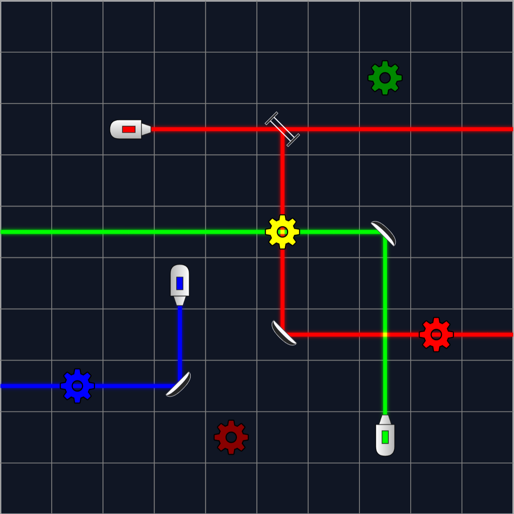

# ReflectIO

[Link](https://www.reflect-rgb.xyz)

## Play Levels

1. Only mirrors are draggable and rotatable.

2. Left click: rotate clockwise

3. Right click: rotate counterclockwise

## Create Levels

1. All objects are draggable and rotatable.
   
2. Left click: rotate clockwise

3. Right click: delete 