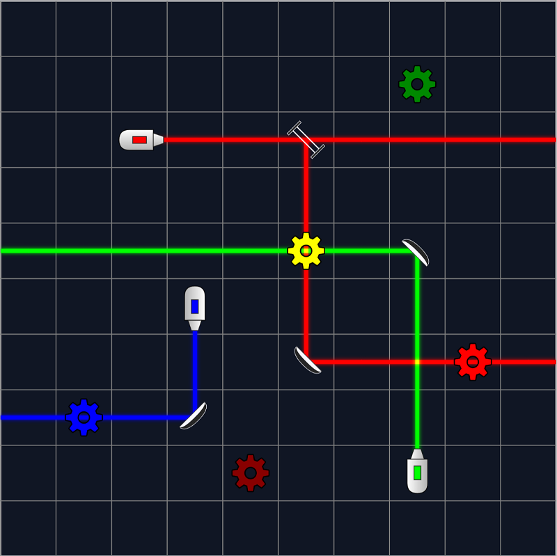

# ReflectIO

## Play Levels

1. Only mirrors are draggable and rotatable.

2. Left Click Mirror: rotate clockwise

3. Right Click Mirror: rotate counterclockwise

## Create Levels

1. All objects are draggable and rotatable.
   
2. Left Click Mirror: rotate clockwise

3. Right Click Mirror: delete 